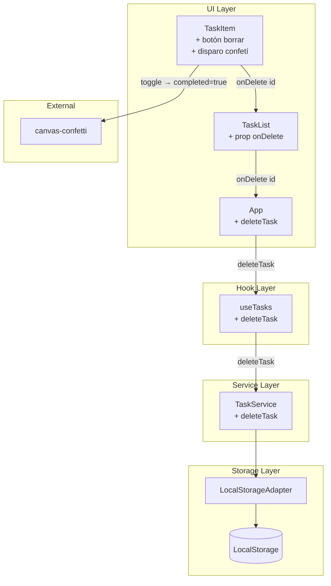

# Documento de Diseño

## Resumen

Se añaden dos capacidades a TaskFlow: disparo de confetí al completar una tarea y borrado de tareas completadas. Ambas se implementan con cambios mínimos y localizados en la capa de servicio, hook y componentes UI, sin alterar el modelo de datos `Task` ni `LocalStorage`.

## Arquitectura

Sin cambios estructurales. Las nuevas interacciones siguen el mismo flujo unidireccional existente.



## Modificaciones por capa

### TaskService — nuevo método `deleteTask(id)`

```ts
deleteTask(id: string): boolean {
  const tasks = this.getAll()
  const index = tasks.findIndex((t) => t.id === id)
  if (index === -1) {
    console.error(`[TaskService] deleteTask: No se encontró la tarea con id "${id}".`)
    return false
  }
  tasks.splice(index, 1)
  this.adapter.save(tasks)
  return true
}
```

Contrato:
- Devuelve `true` si la tarea fue encontrada y eliminada.
- Devuelve `false` y registra en `console.error` si el ID no existe (Req 2.5).
- Persiste el array resultante mediante `LocalStorageAdapter.save()`.

### useTasks — nueva función `deleteTask`

```ts
const deleteTask = useCallback((id: string) => {
  const success = service.deleteTask(id)
  if (success) {
    setTasks((prev) => prev.filter((t) => t.id !== id))
  }
}, [])
```

Se añade `deleteTask` al objeto retornado por el hook.

### TaskItem — botón de borrado + confetí

Nuevas props añadidas al interface `TaskItemProps`:
- `onDelete: (id: string) => void`

Comportamiento del botón:
- Solo se renderiza si `task.completed === true` (Req 2.1, 2.2).
- `aria-label="Eliminar tarea"` para accesibilidad.
- Llama a `onDelete(task.id)` al hacer click.

Comportamiento del confetí:
- Se dispara en el `onChange` del checkbox cuando `!task.completed` (es decir, cuando la transición es de pendiente → completada) (Req 1.1, 1.2).
- Se verifica `window.matchMedia('(prefers-reduced-motion: reduce)').matches` antes de disparar (Req 1.4).
- El efecto usa `confetti({ particleCount: 80, spread: 70, origin: { y: 0.6 } })`.

### TaskList — nueva prop `onDelete`

```ts
interface TaskListProps {
  tasks: Task[]
  filter: FilterState
  onToggle: (id: string) => void
  onDelete: (id: string) => void   // nueva
}
```

Se pasa `onDelete` a cada `<TaskItem>`.

### App.tsx — conectar `deleteTask`

Se desestructura `deleteTask` de `useTasks()` y se pasa como `onDelete={deleteTask}` a `<TaskList>`.

## Flujos

### Completar tarea con confetí

1. Usuario marca el checkbox de una tarea pendiente.
2. `TaskItem.onChange` detecta que `task.completed` era `false`.
3. Verifica `prefers-reduced-motion`; si no está activo, llama a `confetti(...)`.
4. Llama a `onToggle(task.id)`.
5. `useTasks.toggleTask` llama a `TaskService.toggleCompleted`.
6. Estado actualizado → React re-renderiza → aparece icono `🗑️`.

### Eliminar tarea completada

1. Usuario pulsa `🗑️` en una tarea completada.
2. `TaskItem` llama a `onDelete(task.id)`.
3. `TaskList` propaga a `App` → `deleteTask(id)` en `useTasks`.
4. `TaskService.deleteTask(id)` filtra el array y persiste.
5. `setTasks` actualiza el estado → lista se actualiza inmediatamente (Req 2.4).

## CSS — nuevo estilo para el botón de borrado

En `TaskItem.module.css` añadir:

```css
.deleteBtn {
  background: none;
  border: none;
  cursor: pointer;
  font-size: 1rem;
  padding: 0.25rem;
  margin-left: auto;
  flex-shrink: 0;
  opacity: 0.5;
  transition: opacity 0.2s;
}

.deleteBtn:hover {
  opacity: 1;
}
```

## Manejo de Errores

- ID inexistente en `deleteTask`: registrado en `console.error`, sin crash (Req 2.5).
- `canvas-confetti` importado como módulo ES; si fallara, el error no debe bloquear el toggle (envolver en try/catch defensivo).

## Estrategia de Pruebas

- Pruebas unitarias en `tests/unit/taskService.test.ts`: nuevo `describe('deleteTask()')`.
- Pruebas de integración en `tests/integration/components.test.tsx`: verificar visibilidad del botón según estado y callback `onDelete`.
- El disparo de confetí se prueba mediante mock de `canvas-confetti` en el test de integración de `TaskItem`.

## Trazabilidad con Requisitos

| Requisito | Componentes/archivos |
|-----------|----------------------|
| 1.1 | TaskItem (onChange handler) |
| 1.2 | TaskItem (condicional `!task.completed`) |
| 1.3 | canvas-confetti (async, no bloqueante) |
| 1.4 | TaskItem (matchMedia prefers-reduced-motion) |
| 2.1 | TaskItem (render condicional botón) |
| 2.2 | TaskItem (render condicional botón) |
| 2.3 | TaskItem → TaskList → App → useTasks → TaskService |
| 2.4 | useTasks (setTasks filter) |
| 2.5 | TaskService.deleteTask (console.error + return false) |
