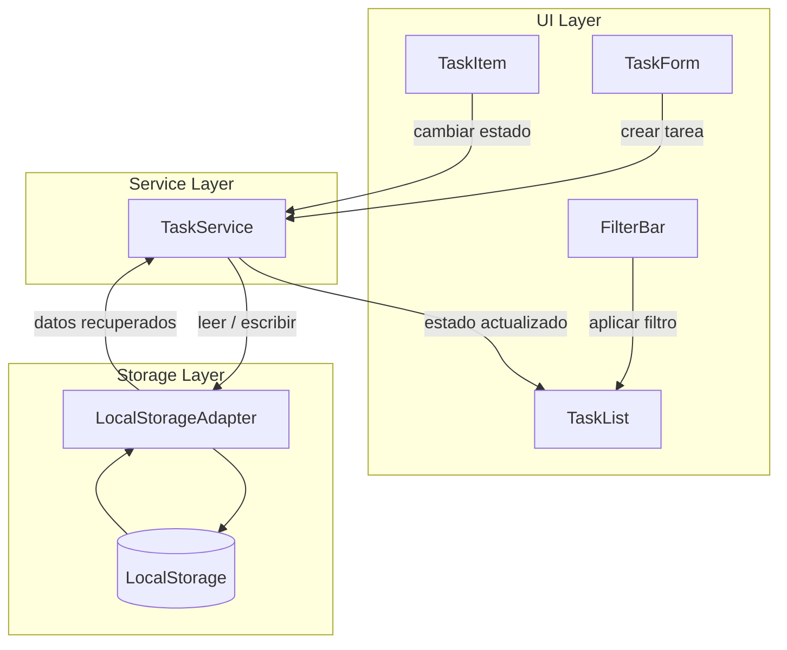

# Documento de Diseño

## Resumen

TaskFlow es una aplicación web SPA desarrollada con React y TypeScript para la gestión personal de tareas. Permite crear tareas, marcarlas como completadas, filtrarlas por estado y persistir la información mediante LocalStorage.

## Arquitectura

Arquitectura Frontend SPA con persistencia local.

## Componentes

### TaskForm

Responsable de registrar nuevas tareas.

### TaskList

Muestra todas las tareas disponibles.

### TaskItem

Representa una tarea individual y permite cambiar su estado.

### FilterBar

Permite filtrar tareas por estado. Soporta tres modos: `all` (todas), `pending` (pendientes) y `completed` (completadas). Mantiene el filtro activo hasta que el usuario lo cambie explícitamente.

### TaskService

Gestiona operaciones CRUD y persistencia.

### LocalStorageAdapter

Abstracción para almacenar y recuperar información del navegador.

## Flujos

### Crear tarea

1. Usuario ingresa título.
2. TaskForm valida información.
3. TaskService crea la tarea.
4. LocalStorageAdapter persiste los datos.
5. TaskList actualiza la vista.

### Completar tarea

1. Usuario selecciona una tarea.
2. TaskItem solicita actualización a TaskService con el ID de la tarea.
3. TaskService verifica que el ID existe; si no existe, registra el error y cancela la operación (ver Req 2.2).
4. TaskService modifica el estado de la tarea.
5. LocalStorageAdapter persiste cambios.
6. UI refleja resultado.

### Filtrar tareas

1. Usuario selecciona filtro.
2. FilterBar actualiza criterio.
3. TaskList aplica filtrado.
4. UI muestra resultados.

## Modelo de Datos

### Task

| Campo | Tipo | Descripción |
|---------|---------|---------|
| id | string | Identificador único (UUID v4) |
| title | string | Título de la tarea (no vacío) |
| completed | boolean | Estado: false = pendiente, true = completada |
| createdAt | string | Fecha de creación en formato ISO 8601 (ej: 2026-10-03T12:00:00Z) |

## Interfaces e Integraciones

### LocalStorage

- Lectura de tareas almacenadas.
- Persistencia automática de cambios.
- Recuperación de datos al iniciar la aplicación.

## Manejo de Errores

- Validación de títulos vacíos.
- Recuperación segura ante datos corruptos.
- Mensajes visuales para operaciones inválidas.

## Seguridad

- No se almacenan credenciales.
- Datos limitados al navegador del usuario.
- Validación básica de entradas.

## Observabilidad

- Registro de errores de persistencia en `console.error` durante desarrollo.
- Sin integración de métricas externas (fuera del alcance del producto actual).

## Estrategia de Pruebas

- Pruebas unitarias para servicios (`tests/unit/`).
- Pruebas de integración de componentes React (`tests/integration/`).
- Pruebas funcionales end-to-end (`tests/taskflow.spec.ts`).
- **Property-Based Testing (PBT)** para invariantes del servicio (`tests/property/`).

### Property-Based Testing

Framework: **fast-check** (ya incluido como devDependency).  
Runner: **Vitest** (mismo que el resto del proyecto).  
Ubicación: `tests/property/taskService.property.test.ts`

Las propiedades verifican invariantes del dominio que deben cumplirse para _cualquier_ entrada válida generada aleatoriamente, no solo para los casos de ejemplo contemplados en las pruebas unitarias.

#### Property 1 — Persistencia consistente

_For any_ colección válida de N tareas, después de crearlas y recuperarlas, el sistema SHALL conservar exactamente N tareas con los mismos títulos.

**Validates:** Requisito 4.1, 4.3

- Generadores: `fc.array(fc.string({ minLength: 1 }))` filtrado a títulos no-vacíos tras trim.
- Invariante: `service.getAll().length === N` y los títulos coinciden en orden.
- Excluir: cadenas que queden vacías al hacer trim.

#### Property 2 — Toggle reversible (idempotencia doble)

_For any_ tarea válida, al alternar el estado `completed` dos veces, el sistema SHALL restaurar el estado original.

**Validates:** Requisito 2.1

- Generadores: `fc.string({ minLength: 1 })` para títulos válidos.
- Invariante: `toggle(toggle(x.completed)) === x.completed`, es decir `completed` final igual al inicial.
- Excluir: tareas con ID inexistente.

#### Property 3 — Filtrado coherente

_For any_ conjunto mixto de tareas, al filtrar por `completed` o `pending`, el sistema SHALL devolver únicamente elementos que cumplan el criterio solicitado.

**Validates:** Requisito 3.1, 3.2, 3.3

- Generadores: `fc.array` de títulos + `fc.array(fc.boolean())` para alternar completados.
- Invariante: ninguna tarea en el resultado filtrado incumple el criterio; la unión de `pending` y `completed` reconstituye `all`.
- Excluir: registros inválidos o IDs duplicados artificiales.

#### Property 4 — Estabilidad ante IDs inexistentes

_For any_ colección de tareas válidas, llamar a `toggleCompleted` con un ID que no existe SHALL dejar la colección inalterada (mismo tamaño y mismos IDs en el mismo orden).

**Validates:** Requisito 2.2

- Generadores: `fc.array` de títulos + `fc.string` para ID falso prefijado.
- Invariante: `getAll()` antes y después produce los mismos IDs en el mismo orden.

## Decisiones y Alternativas

### React + TypeScript

Elegido por simplicidad, productividad y compatibilidad con el ecosistema Kiro.

### LocalStorage

Elegido para evitar backend y mantener el proyecto pequeño.

### SPA

Elegida para minimizar complejidad operativa.

## Trazabilidad con Requisitos

| Criterio | Componentes responsables |
|-----------|--------------------------|
| 1.1 | TaskForm, TaskService, LocalStorageAdapter |
| 1.2 | TaskForm |
| 1.3 | TaskList |
| 2.1 | TaskItem, TaskService, LocalStorageAdapter |
| 2.2 | TaskService |
| 2.3 | TaskItem |
| 3.1 | FilterBar, TaskList |
| 3.2 | TaskList |
| 3.3 | FilterBar |
| 4.1 | LocalStorageAdapter, TaskService |
| 4.2 | LocalStorageAdapter |
| 4.3 | TaskService, LocalStorageAdapter |
